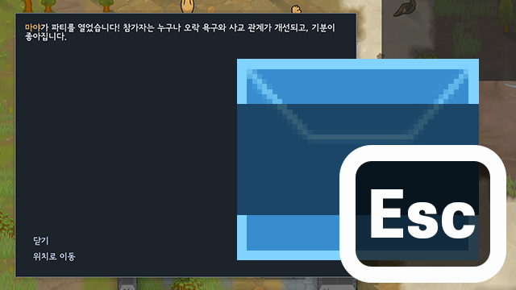

#  Esc Closes Letters

  
[English](./README.md) | [한국어](./README.ko.md)

레터 팝업을 `취소` 및 `확인` 키로 닫을 수 있게 해 주는 림월드 모드입니다.

## 기능

- 레터 팝업을 `취소` 혹은 `확인` 키로 닫습니다. 모드 설정에서 키 사용 여부를 선택할 수 있습니다.
- 닫기에 사용될 선택지는 `확인`, `닫기`, `미루기`, `거절` 등이 있으며, 모드 설정에서 대상 여부를 선택할 수 있습니다.
  - `확인` 및 `닫기`는 기본적으로 켜져 있으며, 나머지는 기본적으로 비활성화되어 있습니다.

## 지원 RimWorld 버전

- `1.4`, `1.5`, `1.6`

## 선행 모드

- [Harmony](https://steamcommunity.com/sharedfiles/filedetails/?id=2009463077)

## 호환성

대부분의 모드와 호환되어야 합니다.

## 세이브 호환성

이 모드는 세이브 파일을 수정하지 않으므로 언제든 추가/삭제가 가능합니다.

## 라이선스

- MIT
